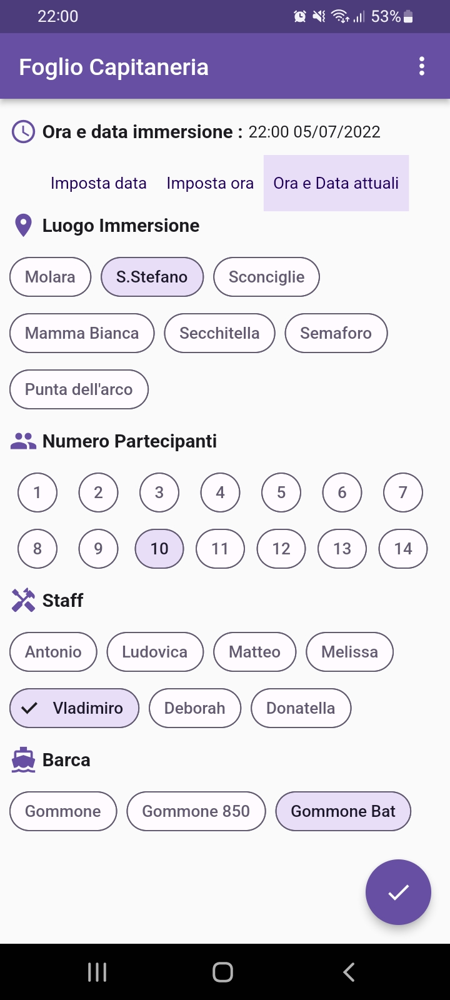

# Foglio Capitaneria

L'applicazione, programmata usando Flutter, permette di generare l'allegato 6 della capitaneria di porto.

Premendo i "tre pallini" si accede alle impostazioni dove è possibile modificare i dati che verranno visualizzati nella pagina iniziale e che verranno inseriti nel pdf.

le **Impostazioni** sono:

* **Nome Società :** indica il nome della società / circolo sportivo / associazione / impresa che verrà inserito nel primo campo dell'allegato 6.

*  **Punti di immersione :** permette di modificare la lista dei possibili punti di immersione che potrebbero essere inseriti nel campo **luogo** dell'allegato.
Ogni elemento verrà raffigurato come un diverso pulsante nella pagina principale.

* **Numero massimo partecipanti :** il numero n inserito indica il numero di pulsanti, da 1 a n, raffigurati nella pagina principale.
Il risultato delle scelta sarà inserito nel campo **Numero Partecipanti** dell'allegato.

* **Membri staff :** Permette di modificare la lista di nomi che potrebbero essere inseriti nel campo **Nominativo istruttore responsabile ed eventuali assistenti** dell'allegato.
Ogni elemento verrà raffigurato come un diverso pulsante nella pagina principale.

* **Barche :** Permette di modificare la lista delle barche che potrebbero essere inserite nel campo **Unità navale utilizzata** dell'allegato.
Ogni elemento verrà raffigurato come un diverso pulsante nella pagina principale.

Selezionando le chip nella pagina principale e premendo il pulsante in basso a destra viene generato il pdf con i campi selezionati.

